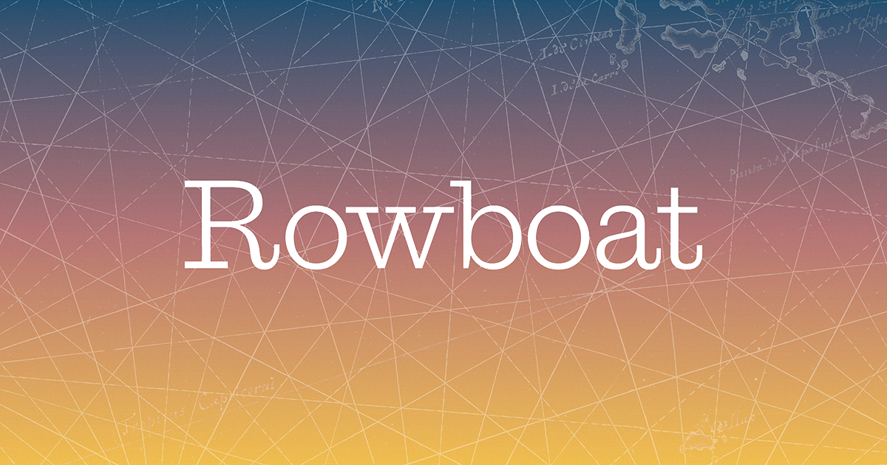

## Summary
A lightning fast tool for understanding large datasets.

## Key Details
- **Source:** [rowboat.net](https://rowboat.net/product/)
- **Title:** Rowboat
- **Description:** A lightning fast tool for understanding large datasets.

## Visual Assets

