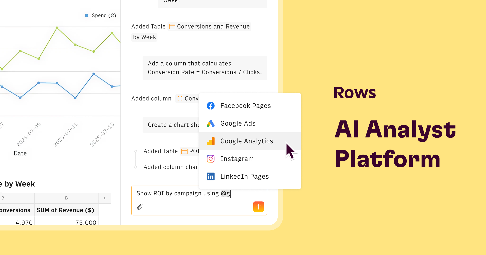

## Summary
For decision makers who want autonomy over their data. Instead of BI dashboards, copy pasting PDFs, writing SQL queries, scripts, or stitching together spreadsheets, Rows gives business teams the abil

## Key Details
- **Source:** [rows.com](https://rows.com/riddler-699ed7bf)
- **Title:** Rows — The AI Analyst Platform
- **Description:** For decision makers who want autonomy over their data. Instead of BI dashboards, copy pasting PDFs, writing SQL queries, scripts, or stitching togethe

## Visual Assets

