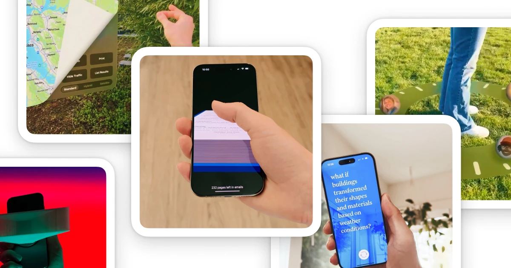

## Summary
Ryan Stephen is a product designer and prototyper with a background designing digital, spatial, and fluid interfaces. He is based in Seattle, WA and works at Microsoft.

## Key Details
- **Source:** [ryanstephen.co](https://ryanstephen.co/)
- **Title:** Ryan Stephen
- **Description:** Ryan Stephen is a product designer and prototyper with a background designing digital, spatial, and fluid interfaces. He is based in Seattle, WA and w

## Visual Assets

