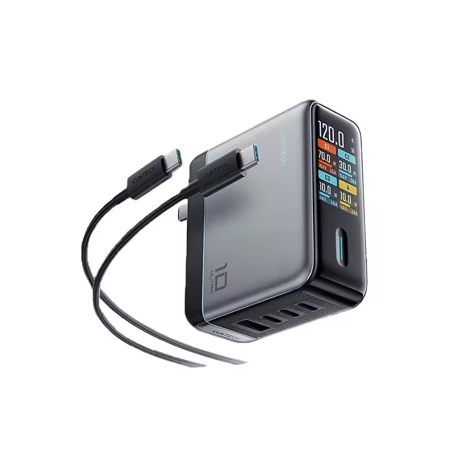

## Summary
Thông số kỹ thuật:

 	Model: AD1204U
 	Size: 67 x 76 x 33mm
 	Port: Type-C×3 + USB-A×1
 	Input1: 100-130V 50/60Hz 1.7A
 	Input2: 200-240V 50/60Hz 1.7A

Sạc đơn cổng:

 	USB-C1/USB-C2: 5V-3A,

## Key Details
- **Source:** [cuktechvietnam.vn](https://cuktechvietnam.vn/sac-nhanh-cuktech-10-ultra-gan-120w-super-charger-ad1204u/)
- **Title:** Sạc nhanh CUKTECH 10 Ultra GaN 120W Super Charger – AD1204U
- **Description:** Thông số kỹ thuật:

 	Model: AD1204U
 	Size: 67 x 76 x 33mm
 	Port: Type-C×3 + USB-A×1
 	Input1: 100-130V 50/60Hz 1.7A
 	Input2: 200-240V 50/60H

## Visual Assets

