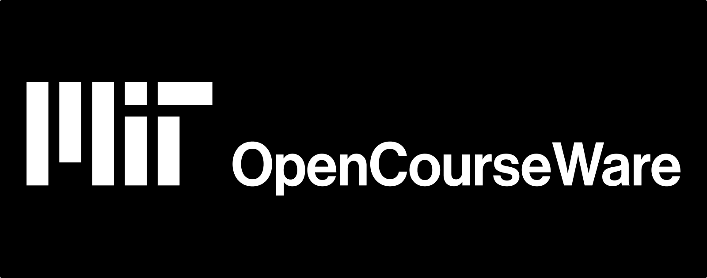

## Summary
MIT OpenCourseWare is a web based publication of virtually all MIT course content. OCW is open and available to the world and is a permanent MIT activity

## Key Details
- **Source:** [ocw.mit.edu](https://ocw.mit.edu/search/)
- **Title:** Search | MIT OpenCourseWare | Free Online Course Materials
- **Description:** MIT OpenCourseWare is a web based publication of virtually all MIT course content. OCW is open and available to the world and is a permanent MIT activ

## Visual Assets

