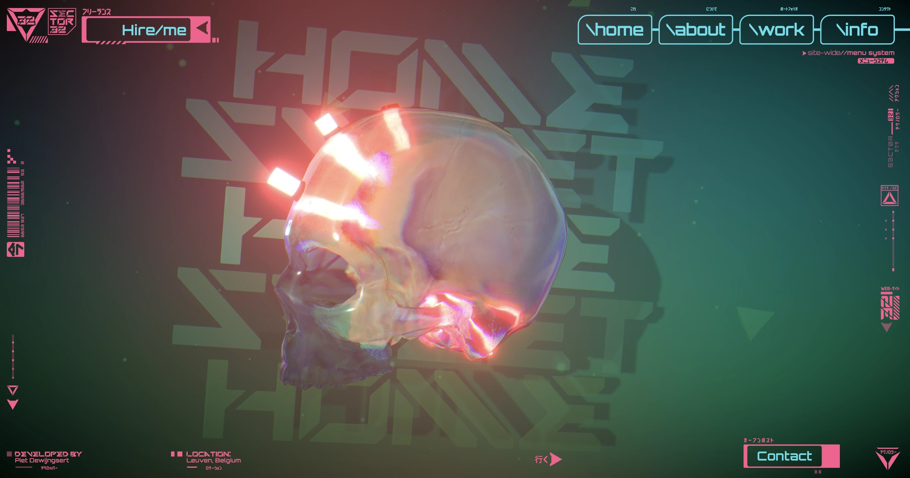

## Summary
Home of Piet Dewijngaert, creative developer

## Key Details
- **Source:** [sector32.net](https://www.sector32.net/)
- **Title:** Sector 32 💀
- **Description:** Home of Piet Dewijngaert, creative developer

## Visual Assets

