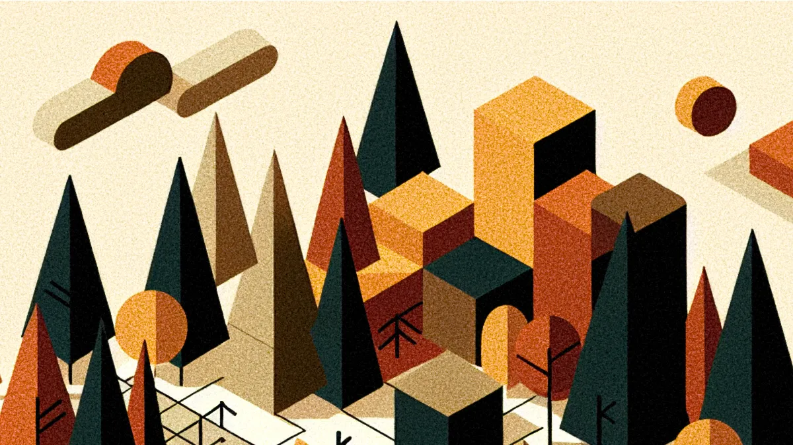

## Summary
How to use knowledge graphs with retrieval augmented generation (RAG) to organize large content repositories.

## Key Details
- **Source:** [jarango.com](https://jarango.com/2024/07/21/seeing-the-forest-using-graph-rag-for-information-architecture/)
- **Title:** Seeing the Forest: Using Graph RAG for Information Architecture
- **Description:** How to use knowledge graphs with retrieval augmented generation (RAG) to organize large content repositories.

## Visual Assets

