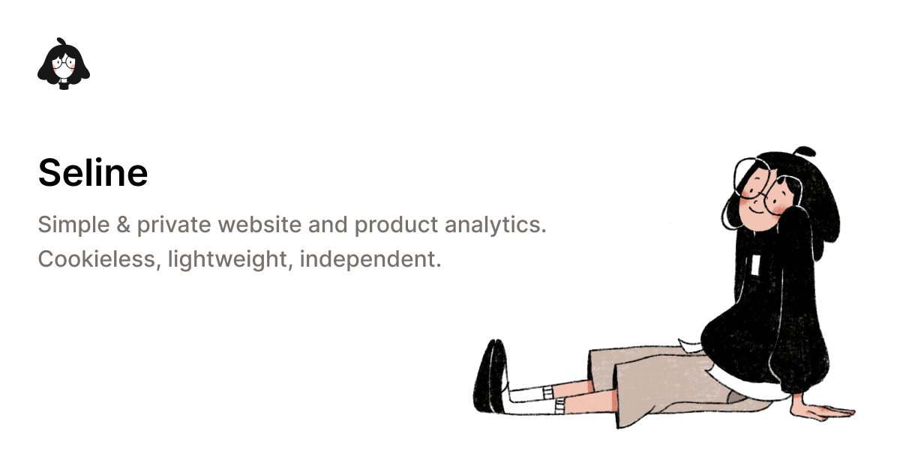

## Summary
Seline is a simple & private website and product analytics platform. Easy to use, no cookies, no personal data collected. Intuitive Google Analytics alternative

## Key Details
- **Source:** [seline.so](https://seline.so/)
- **Title:** Seline Analytics: The simple & actionable Google Analytics alternative
- **Description:** Seline is a simple & private website and product analytics platform. Easy to use, no cookies, no personal data collected. Intuitive Google Analytics a

## Visual Assets

