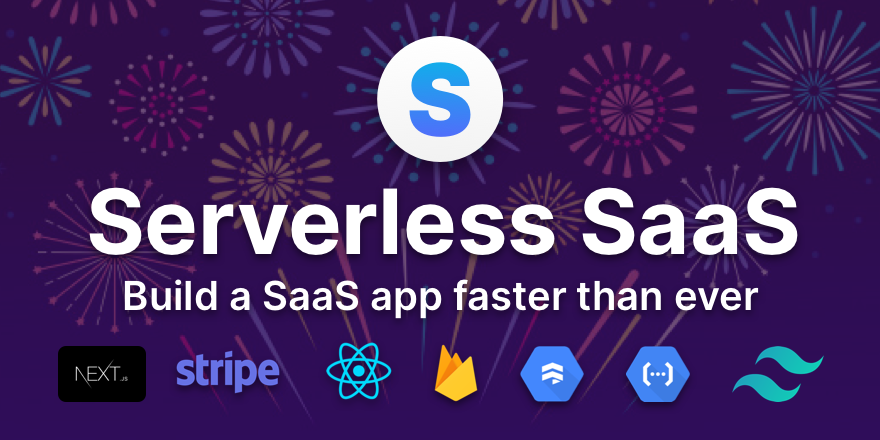

## Summary
Serverless SaaS is aiming to be the perfect starting point for your next React app to build full-stack applications. Save time and skip implementing authentication, payments, teams, etc.

## Key Details
- **Source:** [serverless.page](https://serverless.page/?ref=producthunt)
- **Title:** Serverless SaaS Boilerplate
- **Description:** Serverless SaaS is aiming to be the perfect starting point for your next React app to build full-stack applications. Save time and skip implementing a

## Visual Assets

