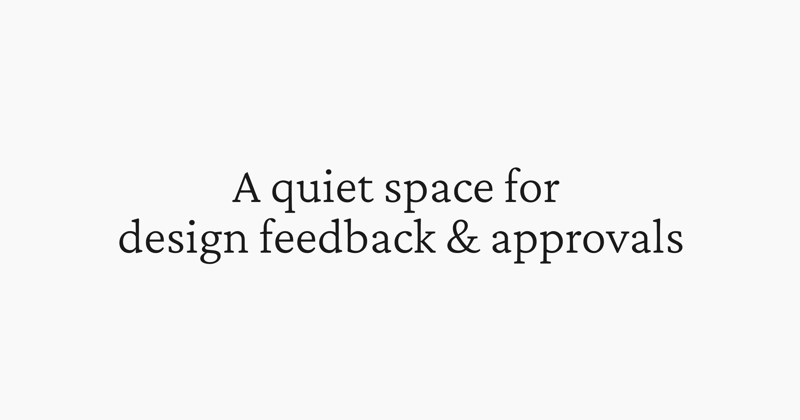

## Summary
Share your designs with your clients and your team to get feedback on websites, figma images, videos, PDFs and more. Try for free.

## Key Details
- **Source:** [workflow.design](https://www.workflow.design/)
- **Title:** Share your designs with your clients and your team to get feedback on websites, figma images, videos, PDFs and more. Try for free.
- **Description:** Share your designs with your clients and your team to get feedback on websites, figma images, videos, PDFs and more. Try for free.

## Visual Assets

