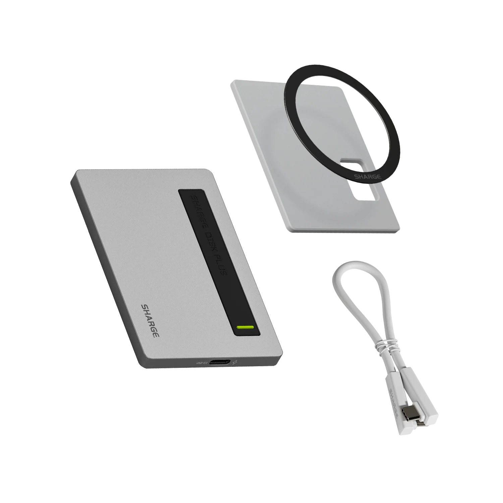

## Summary
World’s thinnest 0.24”. Minimalistic All-aluminum design. Max 10Gbps read &amp; write. Supports up to 4TB storage (SSD not included). Data + charging (PD 100W) simultaneously. Built-in USB-C cable, cl

## Key Details
- **Source:** [in.sharge.com](https://in.sharge.com/products/disk-plus)
- **Title:** Sharge Disk Plus - SD002
- **Description:** World’s thinnest 0.24”. Minimalistic All-aluminum design. Max 10Gbps read &amp; write. Supports up to 4TB storage (SSD not included). Data + charging 

## Visual Assets

