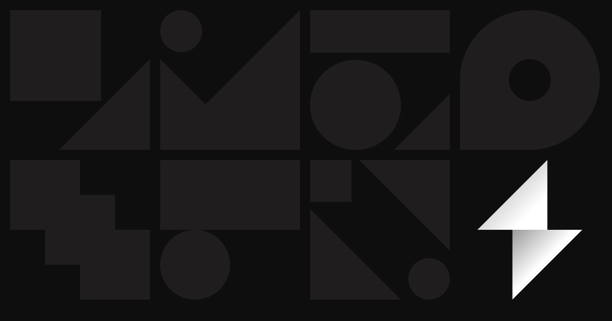

## Summary
Professional interface design training for working designers. A proven framework that helps you articulate design decisions, execute your taste, and finish work to the level it deserves.

## Key Details
- **Source:** [shiftnudge.com](https://shiftnudge.com/)
- **Title:** Shift Nudge - Professional Interface Design Training
- **Description:** Professional interface design training for working designers. A proven framework that helps you articulate design decisions, execute your taste, and f

## Visual Assets

