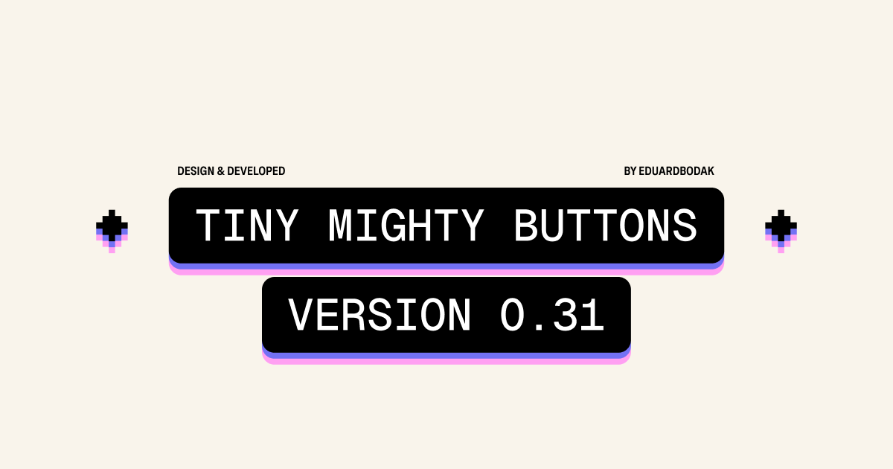

## Summary
Simple Button Animations with CSS in Webflow. No double Content. Respects Touch Devices. Respects User Settings. More Buttons will be added gradually.

## Key Details
- **Source:** [tiny-mighty-buttons.webflow.io](https://tiny-mighty-buttons.webflow.io/)
- **Title:** Simple Button Animations with CSS in Webflow. No double Content. Respects Touch Devices. Respects User Settings. More Buttons will be added gradually.
- **Description:** Simple Button Animations with CSS in Webflow. No double Content. Respects Touch Devices. Respects User Settings. More Buttons will be added gradually.

## Visual Assets

