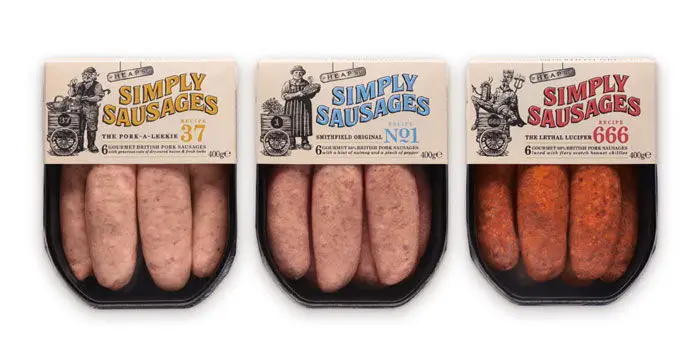

## Summary
“The brief was to create the new identity, packaging and tone of voice for Simply Sausages from Cranswick. The new design needed to reinvigorate the Simply Sausages brand and return it to its former g

## Key Details
- **Source:** [thedieline.com](http://www.thedieline.com/blog/2013/5/3/filirea-gi.html)
- **Title:** Simply Sausages
- **Description:** “The brief was to create the new identity, packaging and tone of voice for Simply Sausages from Cranswick. The new design needed to reinvigorate the S

## Visual Assets

