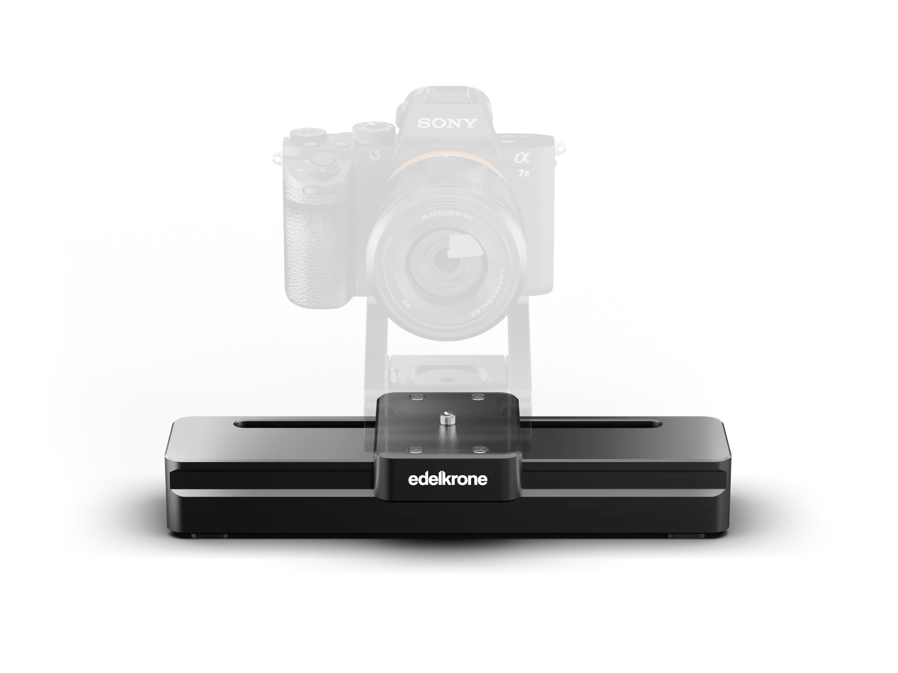

## Summary
SliderONE v3 is a motorized backpack camera slider for smooth, automated motion anywhere, with phone/watch control and wireless pairing with HeadONE or HeadPLUS.

## Key Details
- **Source:** [edelkrone.com](https://edelkrone.com/products/sliderone?utm_source=facebook&utm_medium=paid&campaign_id=120206253119960262&ad_id=120206253119920262)
- **Title:** SliderONE v3
- **Description:** SliderONE v3 is a motorized backpack camera slider for smooth, automated motion anywhere, with phone/watch control and wireless pairing with HeadONE o

## Visual Assets

