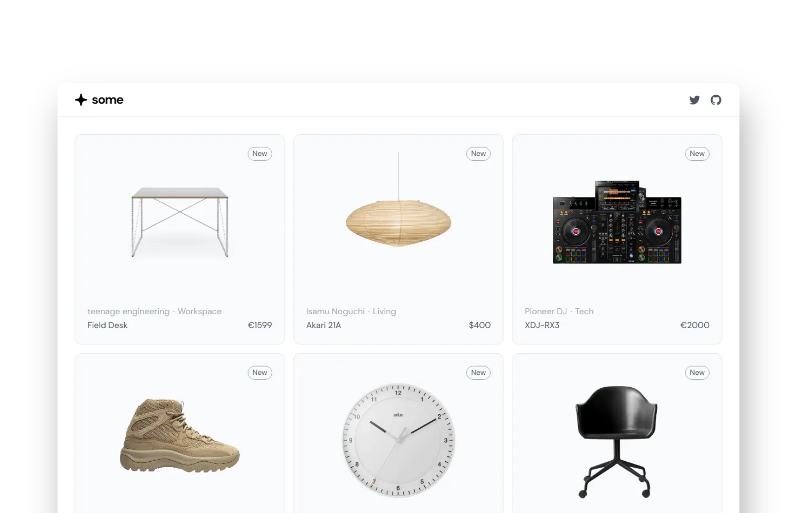

## Summary
Discover beautifully designed minimalist products from around the world.

## Key Details
- **Source:** [some.wtf](https://some.wtf/)
- **Title:** some.wtf
- **Description:** Discover beautifully designed minimalist products from around the world.

## Visual Assets

