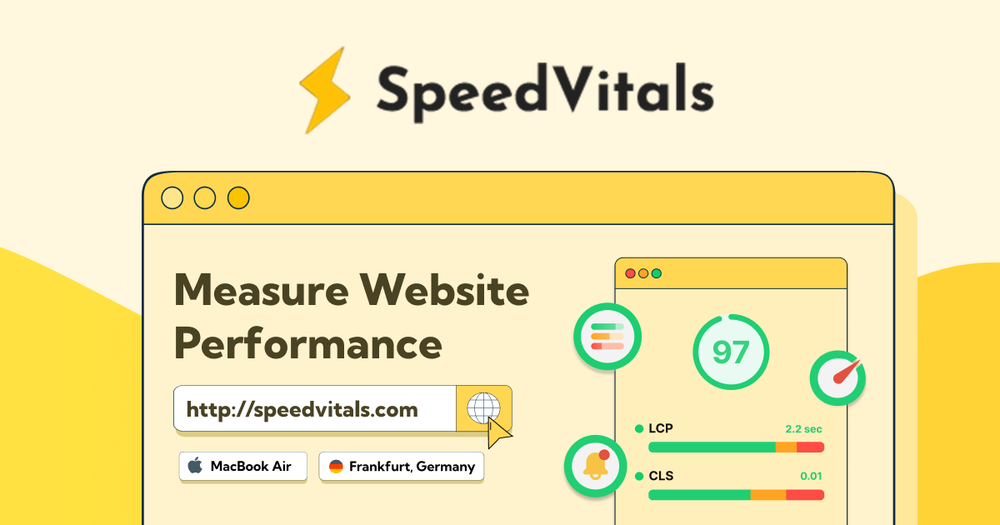

## Summary
Improve your Website Performance and score high in Web Vitals using SpeedVitals Performance Testing Tool.

## Key Details
- **Source:** [speedvitals.com](https://speedvitals.com/)
- **Title:** SpeedVitals - Measure Your Website's Performance
- **Description:** Improve your Website Performance and score high in Web Vitals using SpeedVitals Performance Testing Tool.

## Visual Assets

