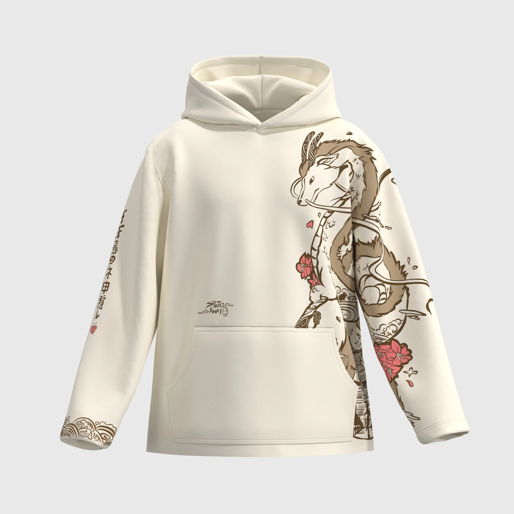

## Summary
Crafted from premium 350 GSM cotton fleece, it offers luxurious softness, durability, and a sustainable edge. Featuring an intricate design of Haku in his majestic dragon form, accented by delicate fl

## Key Details
- **Source:** [oniisaab.com](https://oniisaab.com/products/pre-order-spirited-away-haku-bamboo-cotoon)
- **Title:** Spirited away Haku Hoodie
- **Description:** Crafted from premium 350 GSM cotton fleece, it offers luxurious softness, durability, and a sustainable edge. Featuring an intricate design of Haku in

## Visual Assets

