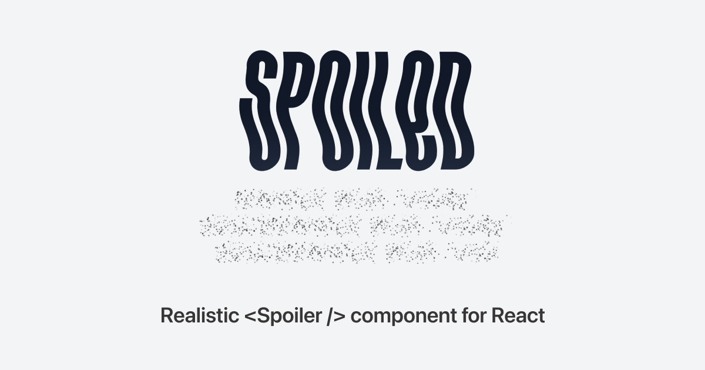

## Summary
Realistic Telegram-inspired spoiler component for React.js

## Key Details
- **Source:** [spoiled.vercel.app](https://spoiled.vercel.app/)
- **Title:** Spoiled
- **Description:** Realistic Telegram-inspired spoiler component for React.js

## Visual Assets

