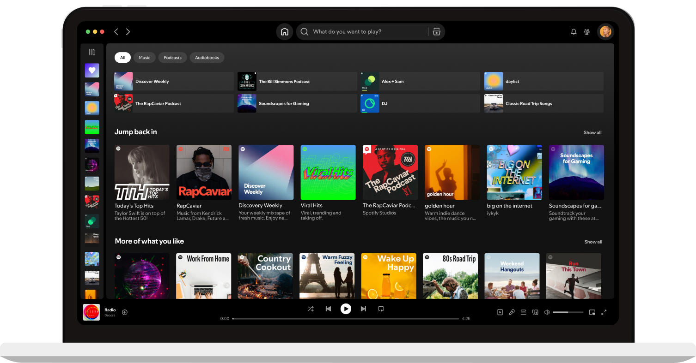

## Summary
Spotify is a digital music service that gives you access to millions of songs.

## Key Details
- **Source:** [spotify.design](https://spotify.design/article/a-designers-balancing-act-staying-creative-and-organized-in-figma)
- **Title:** Spotify - Web Player: Music for everyone
- **Description:** Spotify is a digital music service that gives you access to millions of songs.

## Visual Assets

