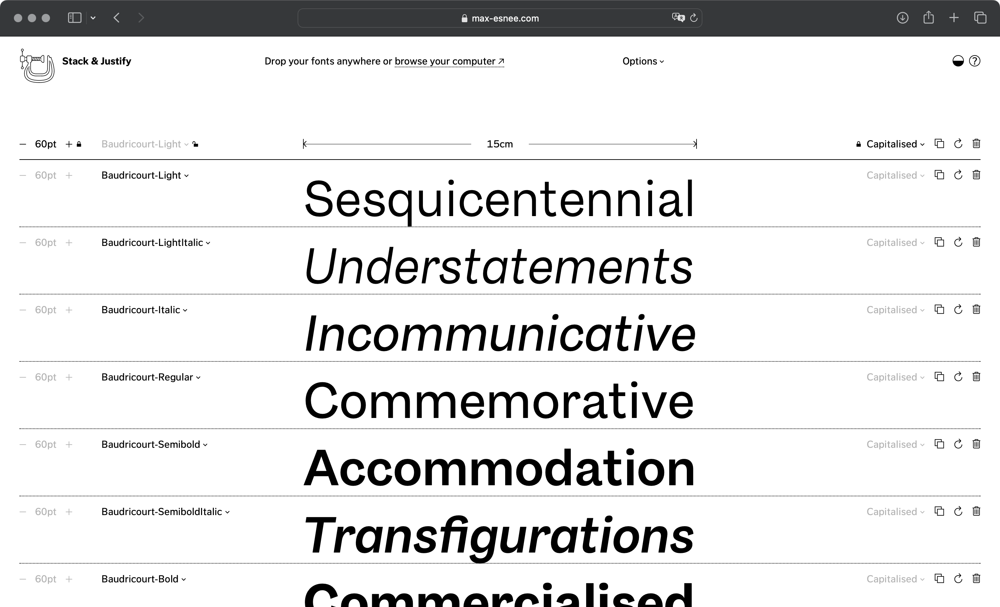

## Summary
Stack & Justify is a tool to help create type specimens by finding words or phrases of the same width. It is free to use and distributed under GPLv3 license.

## Key Details
- **Source:** [max-esnee.com](https://max-esnee.com/stack-and-justify/)
- **Title:** Stack & Justify
- **Description:** Stack & Justify is a tool to help create type specimens by finding words or phrases of the same width. It is free to use and distributed under GPLv3 l

## Visual Assets

