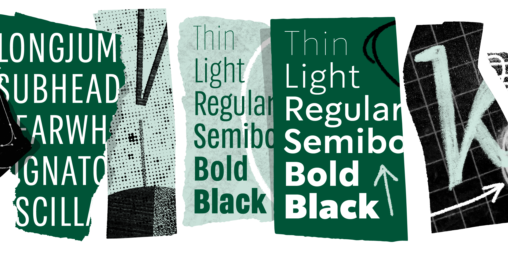

## Summary
A collection of 96 fonts made exclusively for a brand recognized around the world.

## Key Details
- **Source:** [lettermatic.com](https://lettermatic.com/custom/starbucks)
- **Title:** Starbucks Case Study | Lettermatic
- **Description:** A collection of 96 fonts made exclusively for a brand recognized around the world.

## Visual Assets

