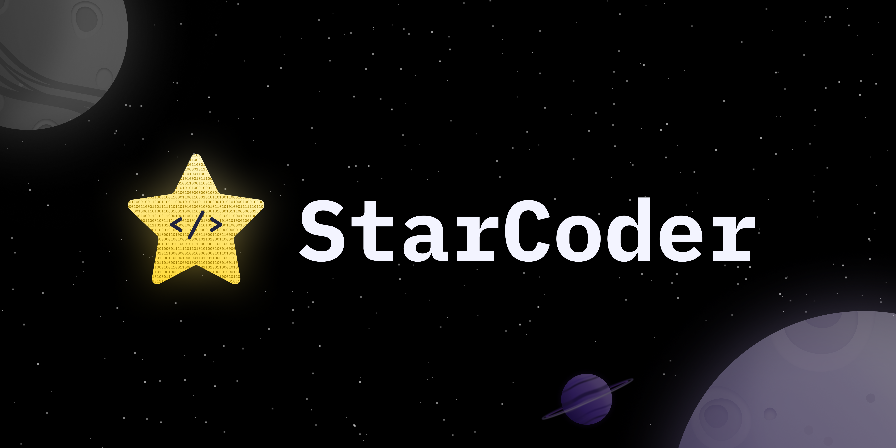

## Summary
We’re on a journey to advance and democratize artificial intelligence through open source and open science.

## Key Details
- **Source:** [huggingface.co](https://huggingface.co/blog/starcoder)
- **Title:** StarCoder: A State-of-the-Art LLM for Code
- **Description:** We’re on a journey to advance and democratize artificial intelligence through open source and open science.

## Visual Assets

