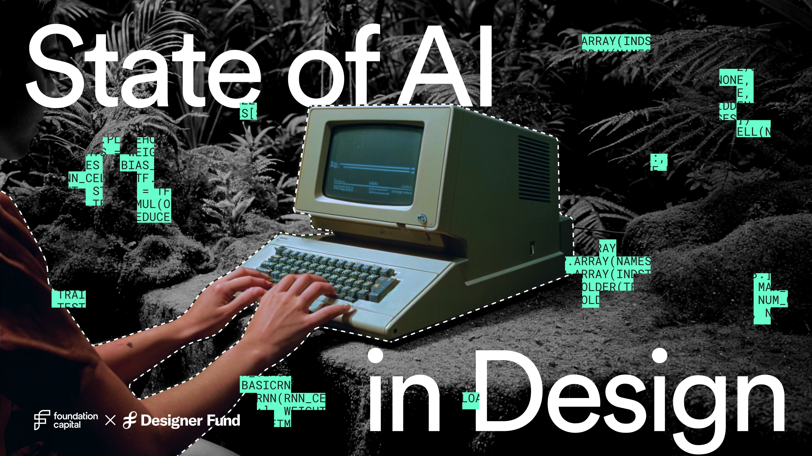

## Summary
The State of AI in Design report is a collaboration between Foundation Capital and Designer Fund that explores how AI is changing the way design teams work, including adoption patterns, pain points, a

## Key Details
- **Source:** [stateofaidesign.com](https://www.stateofaidesign.com/)
- **Title:** State of AI in Design Report 2025
- **Description:** The State of AI in Design report is a collaboration between Foundation Capital and Designer Fund that explores how AI is changing the way design teams

## Visual Assets

