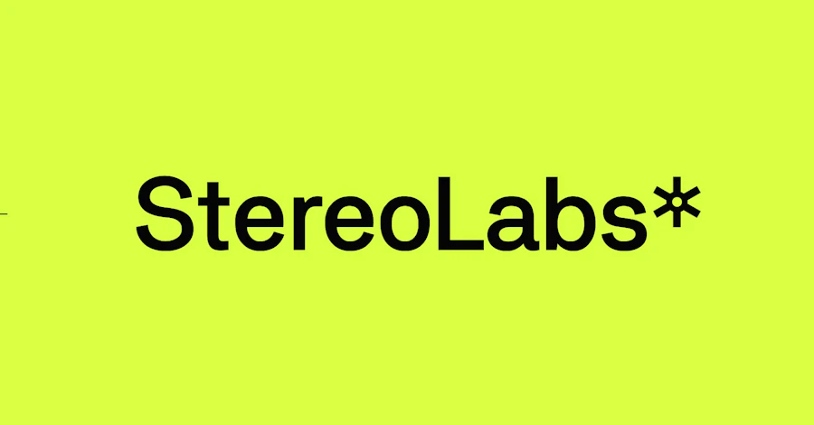

## Summary
Visual identity and website for a pioneering company building technology that gives robots human-like vision, and unlocking insights into spatial analytics.

## Key Details
- **Source:** [pentagram.com](https://www.pentagram.com/work/stereolabs/story)
- **Title:** Stereolabs
- **Description:** Visual identity and website for a pioneering company building technology that gives robots human-like vision, and unlocking insights into spatial anal

## Visual Assets

