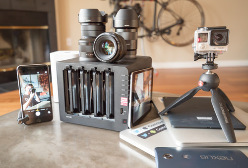

## Summary
How a 12TB Synology DS415+ NAS changed my digital life: Data is eating me alive. Every gadget these days can shoot photos and record video. I captured 275GB of photos and videos on my last trip. Just 

## Key Details
- **Source:** [paulstamatiou.com](https://paulstamatiou.com/storage-for-photographers-part-2)
- **Title:** Storage for Photographers (Part 2)
- **Description:** How a 12TB Synology DS415+ NAS changed my digital life: Data is eating me alive. Every gadget these days can shoot photos and record video. I captured

## Visual Assets

