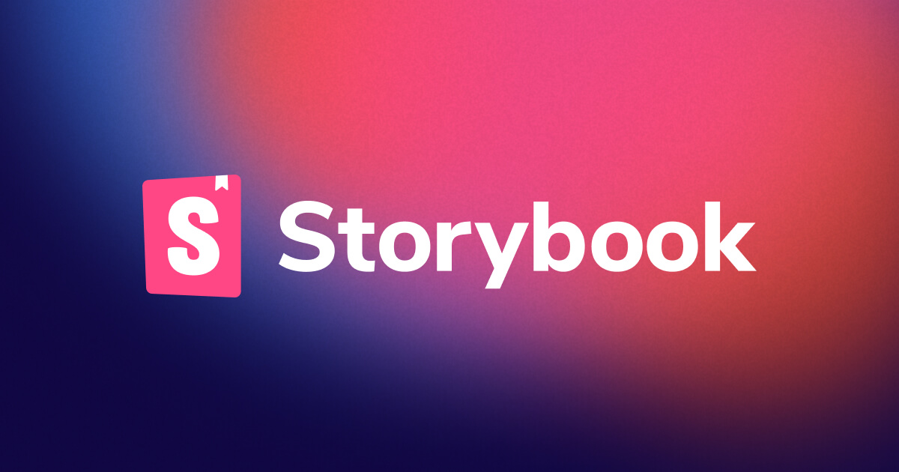

## Summary
Storybook is a frontend workshop for building UI components and pages in isolation. Thousands of teams use it for UI development, testing, and documentation. It's open source and free.

## Key Details
- **Source:** [storybook.js.org](https://storybook.js.org/)
- **Title:** Storybook: Frontend workshop for UI development
- **Description:** Storybook is a frontend workshop for building UI components and pages in isolation. Thousands of teams use it for UI development, testing, and documen

## Visual Assets

