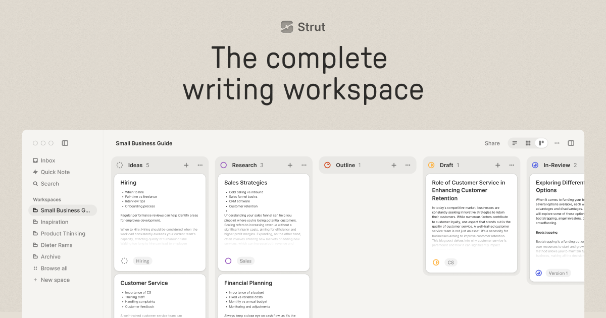

## Summary
Strut combines your notes, docs, and writing projects together in collaborative workspaces powered by AI.

## Key Details
- **Source:** [strut.so](https://strut.so/)
- **Title:** Strut – The complete writing workspace
- **Description:** Strut combines your notes, docs, and writing projects together in collaborative workspaces powered by AI.

## Visual Assets

