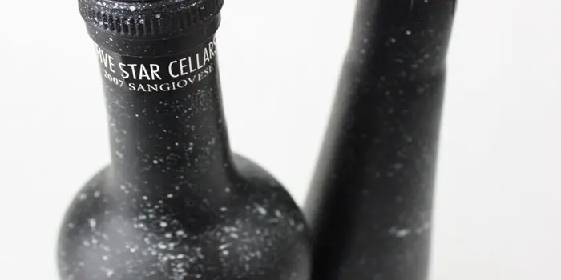

## Summary
For my product packaging class we were given a winery to rebrand. I was assigned Five Star Cellars and a demographic of 21-30 year olds. ” My strategy for speaking to this group was to make the bottle

## Key Details
- **Source:** [thedieline.com](http://www.thedieline.com/blog/2012/7/27/dp-hue.html)
- **Title:** Student Spotlight: Five Star Cellars
- **Description:** For my product packaging class we were given a winery to rebrand. I was assigned Five Star Cellars and a demographic of 21-30 year olds. ” My strategy

## Visual Assets

