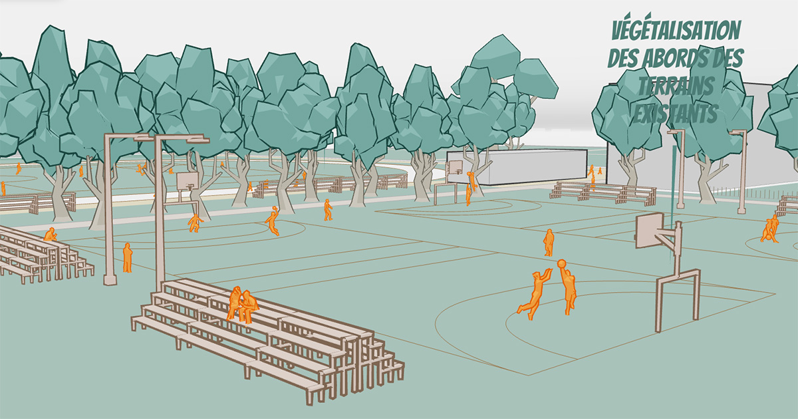

## Summary
Studio Carto propose des cartes interactives pour communiquer sur les projets urbains de manière dynamique. Venez tenter l

## Key Details
- **Source:** [studio-carto-urban-project.netlify.app](https://studio-carto-urban-project.netlify.app/)
- **Title:** Studio Carto - Maquettes interactives urbaines !
- **Description:** Studio Carto propose des cartes interactives pour communiquer sur les projets urbains de manière dynamique. Venez tenter l

## Visual Assets

