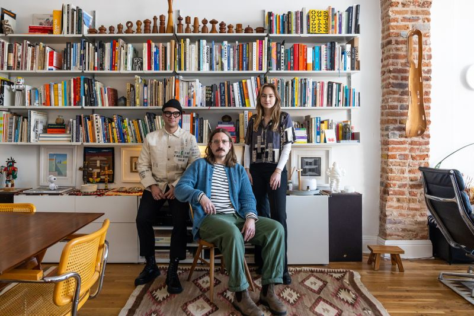

## Summary
From transforming Boulder

## Key Details
- **Source:** [creativeboom.com](https://www.creativeboom.com/inspiration/mast/)
- **Title:** Studio Mast: A legacy of simplicity and storytelling in design
- **Description:** From transforming Boulder

## Visual Assets

