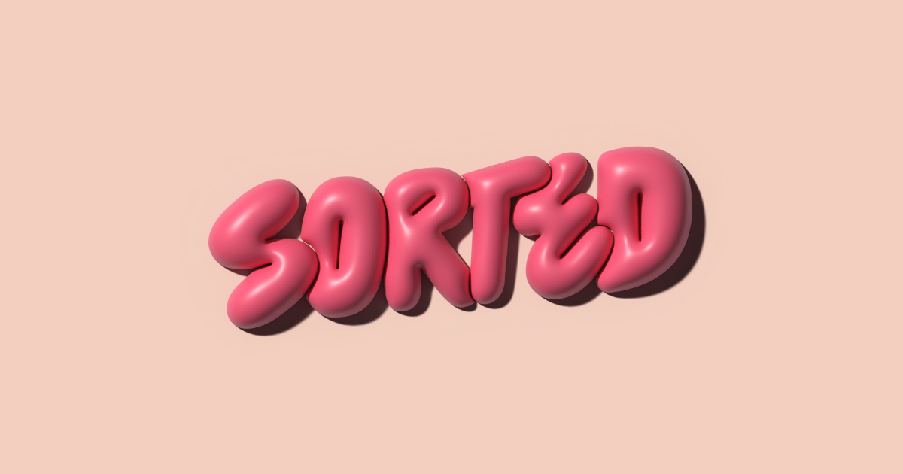

## Summary
Studio Sorted is a bold, strategic branding agency from India that helps brands connect with emerging global audiences. From brand positioning and verbal identity to packaging design and social media 

## Key Details
- **Source:** [studiosorted.com](https://www.studiosorted.com/)
- **Title:** Studio Sorted is a Forbes India & Forbes Asia-recognized branding agency based in Bangalore, India. We deliver bold brand strategy, identity systems, packaging design, verbal identity, and brand guidelines for ambitious, youth-driven brands.
- **Description:** Studio Sorted is a bold, strategic branding agency from India that helps brands connect with emerging global audiences. From brand positioning and ver

## Visual Assets

