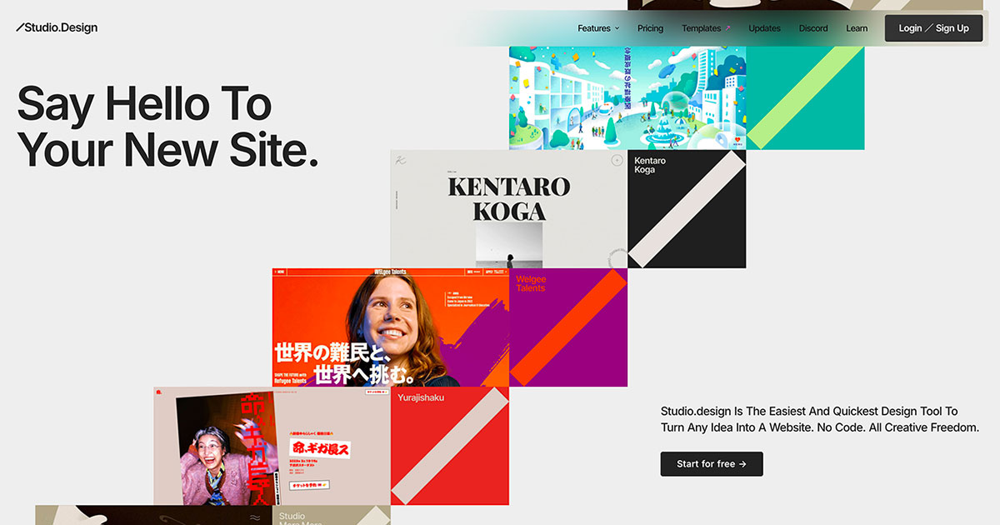

## Summary
The easiest and quickest way to build your beautiful portfolio website, landing page or anything. No code. All creative freedom.

## Key Details
- **Source:** [studio.design](https://studio.design/)
- **Title:** Studio.Design 
- **Description:** The easiest and quickest way to build your beautiful portfolio website, landing page or anything. No code. All creative freedom.

## Visual Assets

