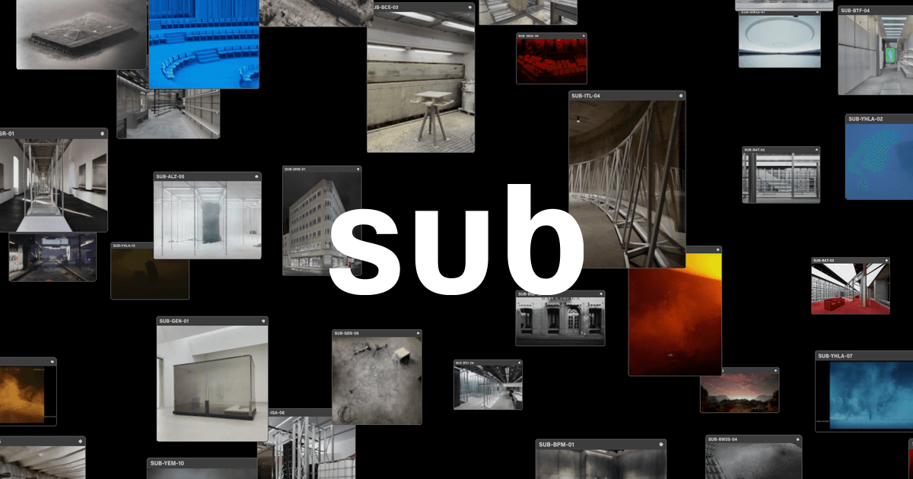

## Summary
Sub is an architecture office founded in 2017 and based in Berlin.

## Key Details
- **Source:** [sub.global](https://sub.global/)
- **Title:** SUB - Home
- **Description:** Sub is an architecture office founded in 2017 and based in Berlin.

## Visual Assets

