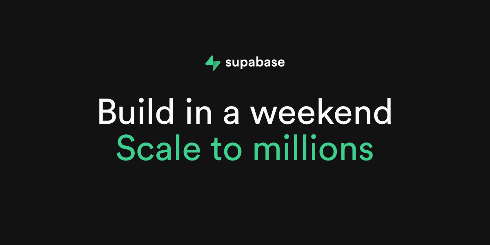

## Summary
Build production-grade applications with a Postgres database, Authentication, instant APIs, Realtime, Functions, Storage and Vector embeddings. Start for free.

## Key Details
- **Source:** [supabase.com](https://supabase.com/)
- **Title:** Supabase | The Postgres Development Platform.
- **Description:** Build production-grade applications with a Postgres database, Authentication, instant APIs, Realtime, Functions, Storage and Vector embeddings. Start 

## Visual Assets

