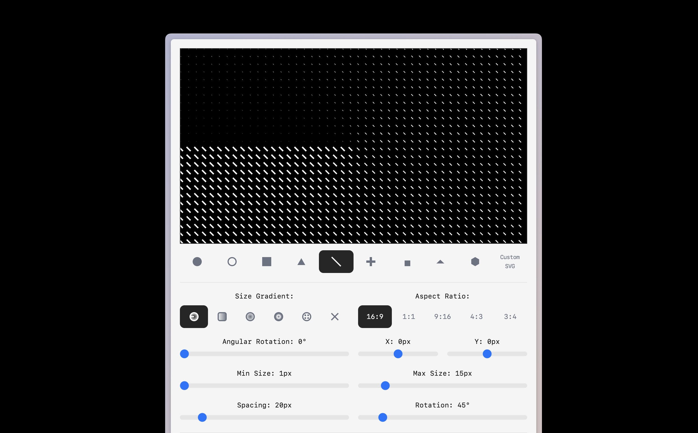

## Summary
SVG Pattern Builder allows you to create, customize, and download unique animated SVG patterns for your web and design projects. Great for Figma, Framer, Webflow and video projects.

## Key Details
- **Source:** [svg.designcode.io](https://svg.designcode.io/)
- **Title:** SVG Pattern Builder - Beautiful Animated Patterns for Design, Video and Web Projects
- **Description:** SVG Pattern Builder allows you to create, customize, and download unique animated SVG patterns for your web and design projects. Great for Figma, Fram

## Visual Assets

