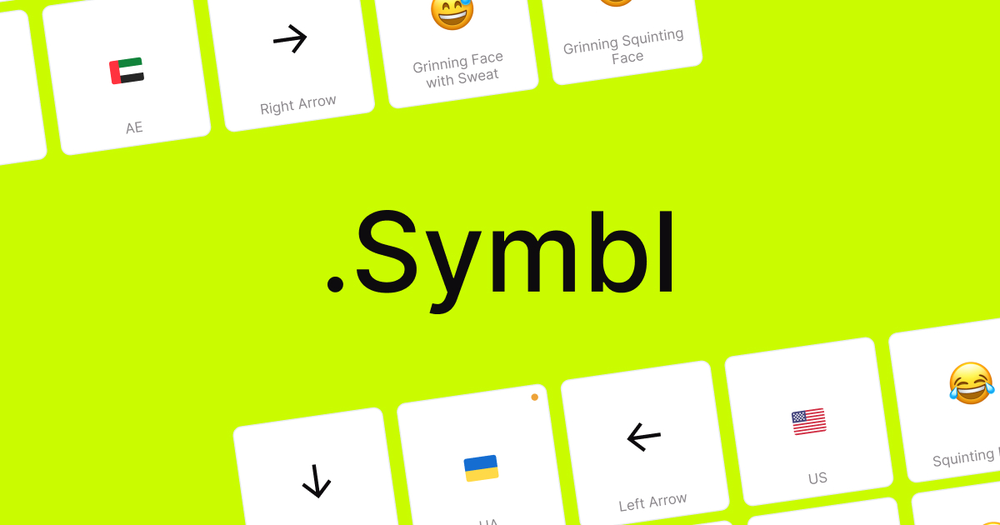

## Summary
Explore and copy a vast collection of HTML symbols, emojis, payment icons, and SVGs with Symbl. Perfect for developers and designers to enhance web projects effortlessly.

## Key Details
- **Source:** [symbl.revend.group](https://symbl.revend.group/?utm_source=uxlift.beehiiv.com&utm_medium=newsletter&utm_campaign=ux-lift-roundup-the-best-ux-and-design-articles-and-resources-from-the-last-few-weeks&_bhlid=19bd2b73f02e812efce2193ffc6a464c73c8c7a7)
- **Title:** Symbl - Your Ultimate Symbol Library
- **Description:** Explore and copy a vast collection of HTML symbols, emojis, payment icons, and SVGs with Symbl. Perfect for developers and designers to enhance web pr

## Visual Assets

