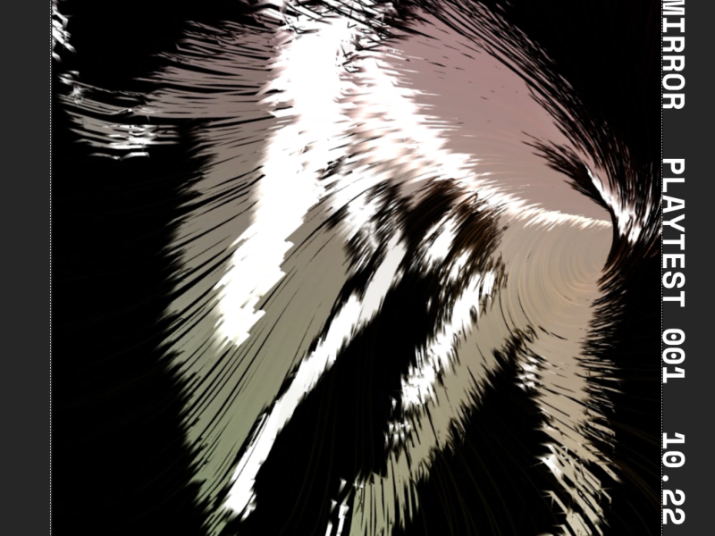

## Summary
Coming soon, Project AE-005: an interactive installation by artist Lisa Jamhoury, exploring the potential for human connection in networked, virtual space. 

## Key Details
- **Source:** [apossible.com](https://apossible.com/applied-experiments/sync-mirror)
- **Title:** sync : mirror — Welcome to New Possibilities
- **Description:** Coming soon, Project AE-005: an interactive installation by artist Lisa Jamhoury, exploring the potential for human connection in networked, virtual s

## Visual Assets

