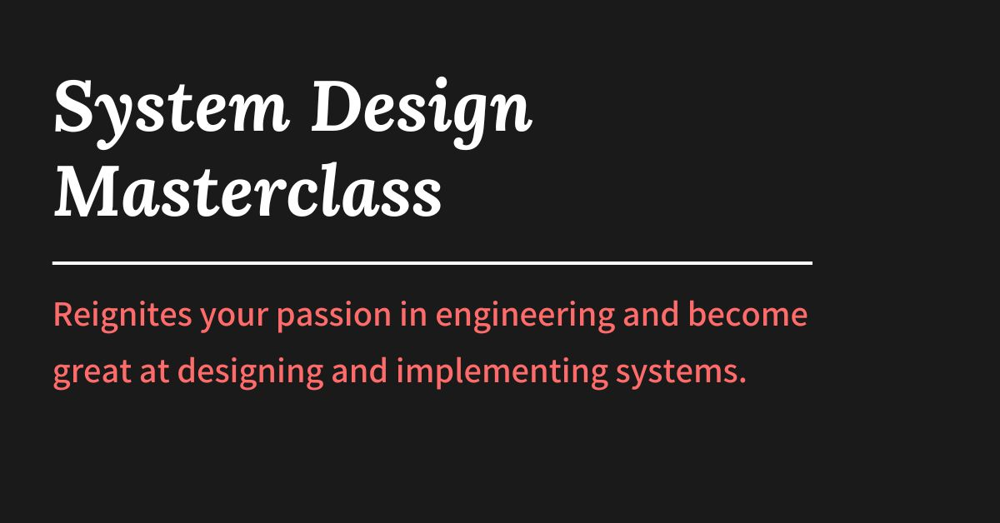

## Summary
An 8-week cohort based course on System Design for SDE-2, SDE-3, and above. A no-fluff masterclass that helps experienced engineers become great at designing and implementing scalable, fault-tolerant,

## Key Details
- **Source:** [arpitbhayani.me](https://arpitbhayani.me/masterclass/)
- **Title:** System Design Masterclass | Arpit Bhayani
- **Description:** An 8-week cohort based course on System Design for SDE-2, SDE-3, and above. A no-fluff masterclass that helps experienced engineers become great at de

## Visual Assets

