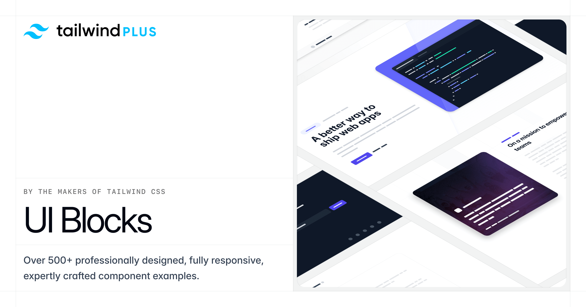

## Summary
Beautiful UI components and templates by the creators of Tailwind CSS.

## Key Details
- **Source:** [tailwindui.com](https://tailwindui.com/components)
- **Title:** Tailwind CSS Components - Tailwind Plus
- **Description:** Beautiful UI components and templates by the creators of Tailwind CSS.

## Visual Assets

