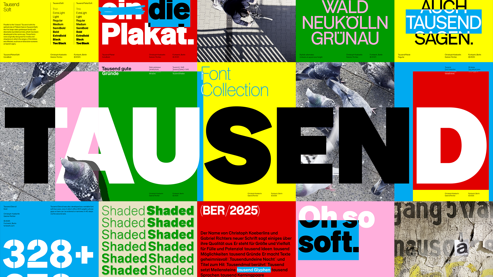

## Summary
In for an a, in for a thousand. The story of a typeface that started small and is making it big.

## Key Details
- **Source:** [fontwerk.com](https://fontwerk.com/en/text/tausend)
- **Title:** Tausend
- **Description:** In for an a, in for a thousand. The story of a typeface that started small and is making it big.

## Visual Assets

