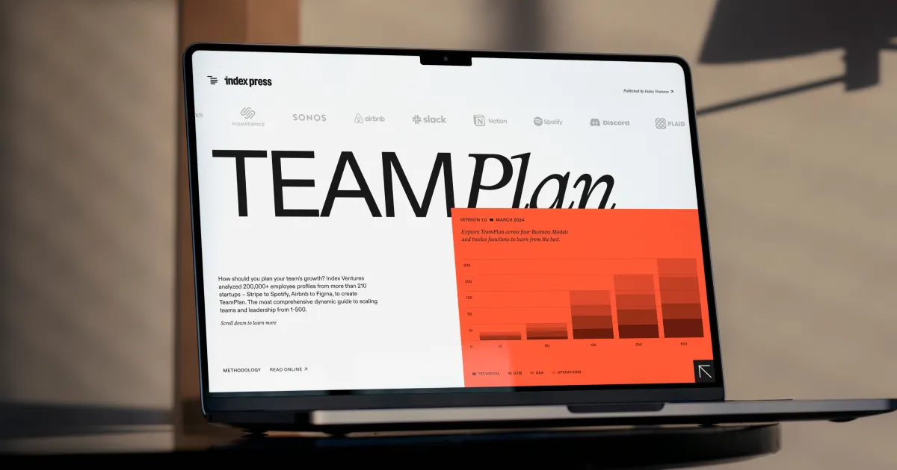

## Summary
TeamPlan is the companion app to our comprehensive handbook for founders on building and leading teams — Scaling through Chaos, which we have made freely available online.

## Key Details
- **Source:** [indexventures.com](https://www.indexventures.com/teamplan/)
- **Title:** TeamPlan | Index Ventures
- **Description:** TeamPlan is the companion app to our comprehensive handbook for founders on building and leading teams — Scaling through Chaos, which we have made fre

## Visual Assets

