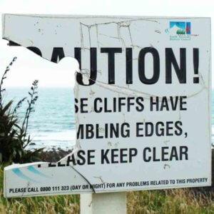

## Summary
Photo by studio tdes. Used under CC BY 2.0 Deed. Image cropped and contrast enhanced. A few days ago Benjy Stanton asked about breaking long words in tables. I offered a suggestion, which may or may n

## Key Details
- **Source:** [adrianroselli.com](https://adrianroselli.com/2024/02/techniques-to-break-words.html)
- **Title:** Techniques to Break Words
- **Description:** Photo by studio tdes. Used under CC BY 2.0 Deed. Image cropped and contrast enhanced. A few days ago Benjy Stanton asked about breaking long words in 

## Visual Assets

