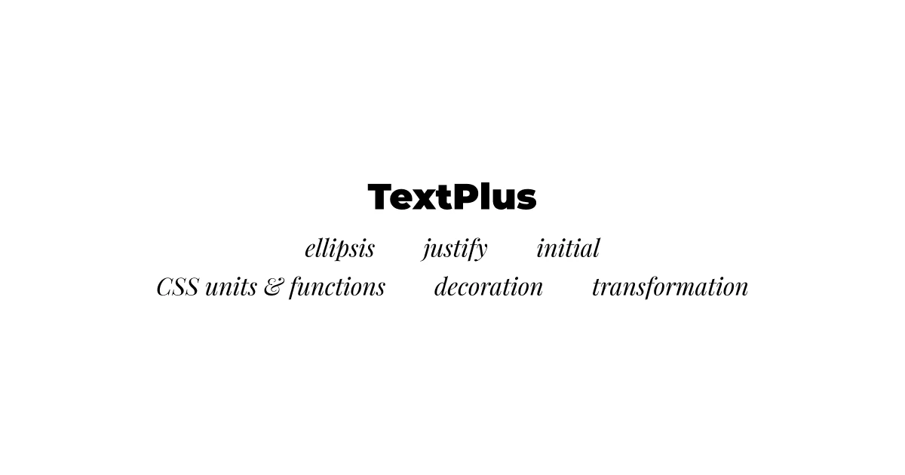

## Summary
TextPlus expands Framer’s built-in text formatting possibilities with features like ellipsis, justify, or initial (drop cap).

## Key Details
- **Source:** [textplus.framer.website](https://textplus.framer.website/)
- **Title:** TextPlus
- **Description:** TextPlus expands Framer’s built-in text formatting possibilities with features like ellipsis, justify, or initial (drop cap).

## Visual Assets

