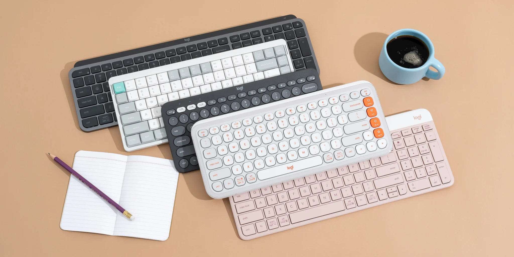

## Summary
The best wireless keyboards are comfortable, reliable, and a joy to type on, whether you want a compact option like the Logitech Pop Icon Keys or something full-size.

## Key Details
- **Source:** [nytimes.com](https://www.nytimes.com/wirecutter/reviews/the-best-bluetooth-keyboard/)
- **Title:** The Best Bluetooth and Wireless Keyboards
- **Description:** The best wireless keyboards are comfortable, reliable, and a joy to type on, whether you want a compact option like the Logitech Pop Icon Keys or some

## Visual Assets

