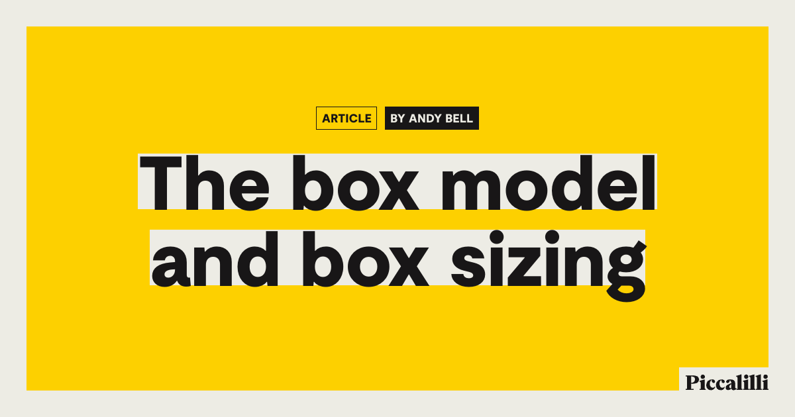

## Summary
To open up this CSS Fundamentals series, we’re looking at one of those most important aspects of CSS to understand: how the box model is affected by box sizing.

## Key Details
- **Source:** [piccalil.li](https://piccalil.li/blog/the-box-model-and-box-sizing/)
- **Title:** The box model and box sizing
- **Description:** To open up this CSS Fundamentals series, we’re looking at one of those most important aspects of CSS to understand: how the box model is affected by b

## Visual Assets

