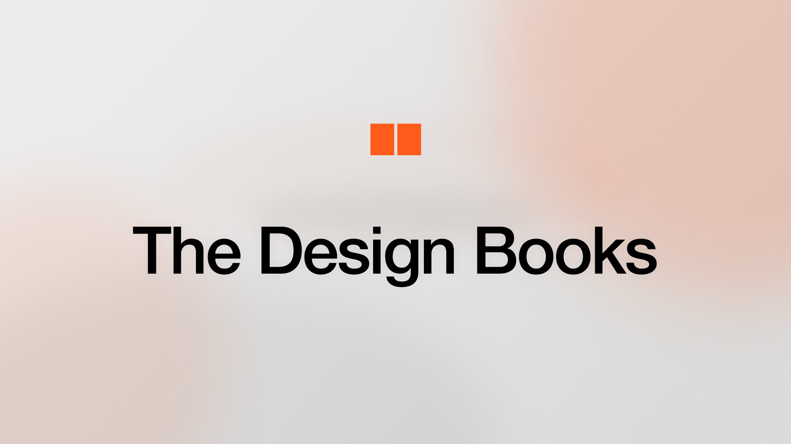

## Summary
Your go-to destination for expertly curated, top-quality design books, providing designers with the best resources to enhance their creative projects.

## Key Details
- **Source:** [thedesignbooks.com](https://thedesignbooks.com/)
- **Title:** The Design Books | Find the best design books curation
- **Description:** Your go-to destination for expertly curated, top-quality design books, providing designers with the best resources to enhance their creative projects.

## Visual Assets

