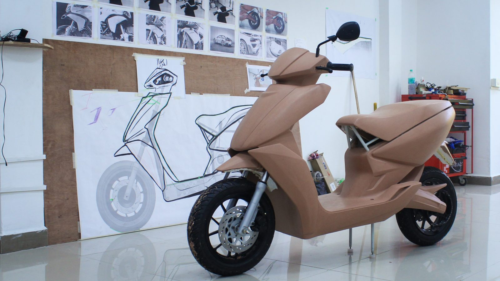

## Summary
Ather Energy has earned a place in India’s crowded EV market by designing to meet local needs.

## Key Details
- **Source:** [restofworld.org](https://restofworld.org/2024/ather-ev-scooters-india/)
- **Title:** The design-obsessed Indian scooter company with global ambitions
- **Description:** Ather Energy has earned a place in India’s crowded EV market by designing to meet local needs.

## Visual Assets

