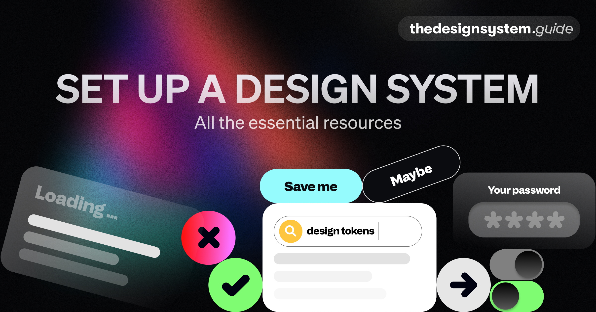

## Summary
Set Up a Design System. Guide, Resources, Useful Tools, Checklists

## Key Details
- **Source:** [thedesignsystem.guide](https://thedesignsystem.guide/)
- **Title:** The Design System Guide
- **Description:** Set Up a Design System. Guide, Resources, Useful Tools, Checklists

## Visual Assets

