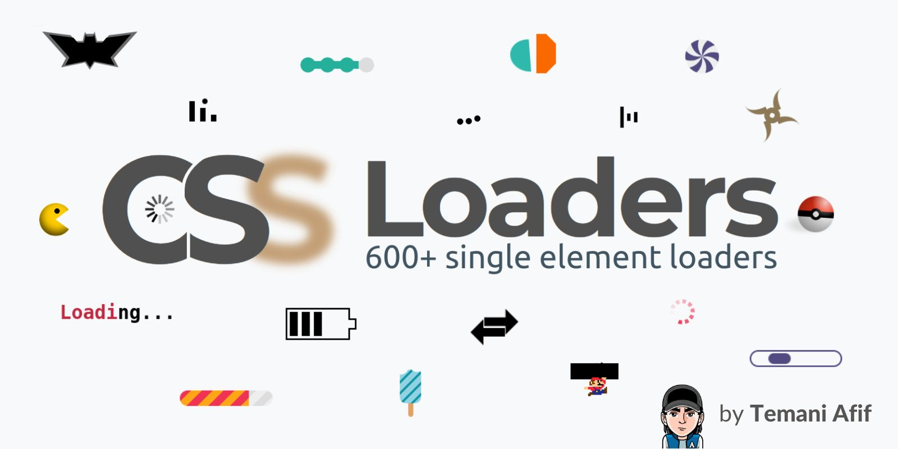

## Summary
CSS-only loading animations made by Temani Afif using a single element.

## Key Details
- **Source:** [css-loaders.com](https://css-loaders.com/dots/)
- **Title:** The Dots CSS Loaders Collection
- **Description:** CSS-only loading animations made by Temani Afif using a single element.

## Visual Assets

